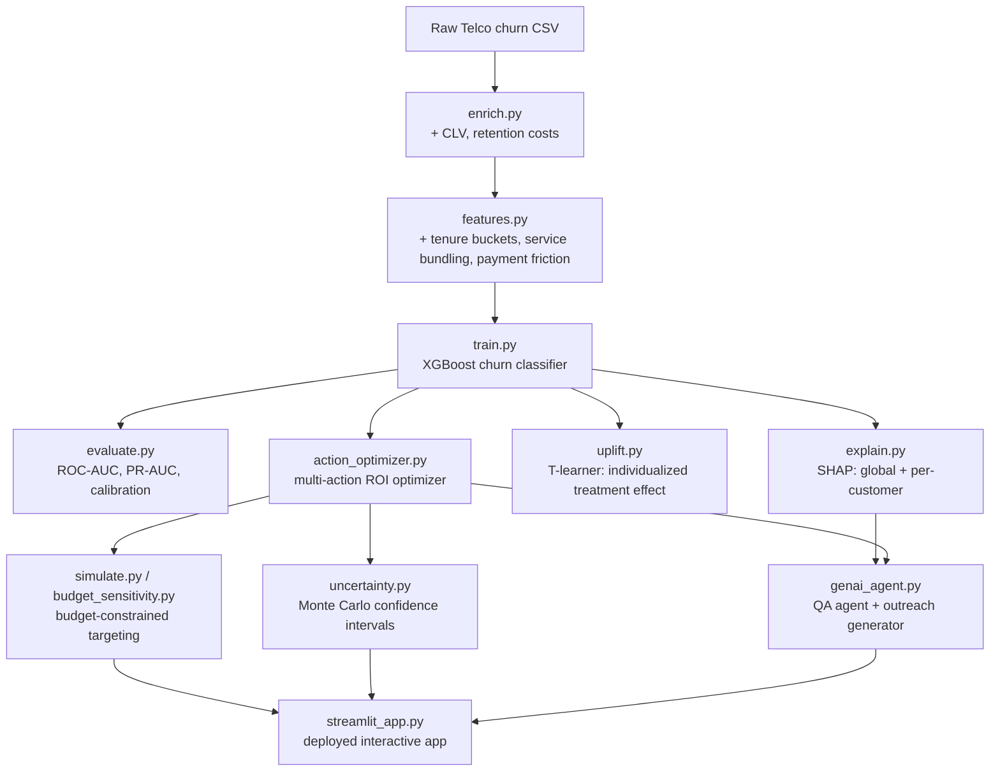

# Customer Churn Prediction & Retention ROI Optimizer

Predict which customers are about to churn, work out exactly what it's
worth to save them, and recommend the single best retention action —
chosen from a real menu of options, backed by exact math, explained per
customer, and wrapped in a natural-language agent a non-technical user
can actually talk to.

> **Live demo:** *(add your Streamlit Community Cloud link here once deployed)*
> **Screenshots:** *(add a few screenshots of the app here — budget slider, SHAP explanation, customer card)*

---

## Table of contents
- [Business problem](#business-problem)
- [Architecture](#architecture)
- [Dataset](#dataset)
- [ML pipeline](#ml-pipeline)
- [Feature engineering](#feature-engineering)
- [Model selection & evaluation](#model-selection--evaluation)
- [From "predict churn" to "recommend an action"](#from-predict-churn-to-recommend-an-action)
- [Uplift modeling](#uplift-modeling-a-sharper-version-of-whos-worth-targeting)
- [Confidence intervals](#confidence-intervals-not-just-a-point-estimate)
- [Explainability (SHAP)](#explainability-shap)
- [GenAI agent layer](#genai-agent-layer)
- [Results](#results)
- [Limitations](#limitations)
- [Setup](#setup)
- [Future work](#future-work)

---

## Business problem

A subscription business is losing customers. The naive response is "predict
who's about to churn and reach out to them." But that leaves three real
business questions unanswered:

1. **Is it worth it?** Reaching out costs money. Is the expected value of
   saving this customer bigger than the cost of trying?
2. **What's the best way to reach out?** An email, a text, a phone call, and
   a discount all cost different amounts and work at different rates —
   which one should we actually use for *this* customer?
3. **How much can we afford to spend?** A retention team can't call
   everyone. Given a fixed budget, who should get the call?

This project answers all three, end-to-end: from raw customer data to a
ranked, budget-aware, ROI-optimized action plan — with an AI agent on top
that can explain any of it in plain language.

## Architecture



## Dataset

Base data: the [Telco Customer Churn dataset](https://www.kaggle.com/datasets/blastchar/telco-customer-churn)
(IBM/Kaggle) — 7,043 customers, contract type, tenure, service usage, and
churn label. This is realistic enough (real churn drivers like contract
type and tenure) but doesn't include financial value or campaign cost data,
so those are added:

- **Customer Lifetime Value (CLV)**: historical spend + projected future
  spend, discounted for month-to-month contracts (higher churn risk =
  less "sticky" future revenue). See `enrich.py`.
- **Retention action costs**: assumed costs for email, SMS, phone call, and
  discount campaigns. See `action_optimizer.py`.

Both are clearly labeled as assumptions throughout — in a real deployment
these would come from finance and marketing systems instead.

## ML pipeline

1. `enrich.py` — adds CLV and campaign cost columns
2. `features.py` — feature engineering (see below)
3. `train.py` — trains and compares Logistic Regression (baseline) vs.
   XGBoost, evaluated on PR-AUC (not accuracy — churn is imbalanced)
4. `evaluate.py` — full model monitoring: ROC-AUC, PR-AUC, precision,
   recall, confusion matrix, and a calibration curve
5. `explain.py` — SHAP global feature importance + per-customer explanations
6. `uplift.py` — causal uplift modeling (T-learner) with Qini evaluation
7. `action_optimizer.py` — multi-action ROI optimizer
8. `simulate.py` / `budget_sensitivity.py` — budget-constrained targeting
   and the value-based-vs-naive comparison
9. `uncertainty.py` — Monte Carlo confidence intervals on revenue saved
10. `genai_agent.py` — Q&A agent (tool-calling) + outreach message generator
11. `streamlit_app.py` — ties everything together into a deployable app

## Feature engineering

Beyond the raw columns, `features.py` adds:
- **Tenure buckets** (0–6mo, 6–12mo, 1–2yr, 2–4yr, 4yr+) — churn risk is
  highly non-linear in tenure, concentrated in the first year
- **Service bundle count** — customers with more bundled add-ons churn less
- **Payment friction flag** — electronic check payers churn more than
  autopay users in this dataset, a proxy for "less committed" payment setup
- **Price-per-service** — a rough price-sensitivity signal

## Model selection & evaluation

Logistic Regression (interpretable baseline) vs. XGBoost, compared on
**PR-AUC** rather than accuracy, since churn is imbalanced (~26–27%) and a
model that predicts "no churn" for everyone would still score ~73% accuracy
while being useless.

`evaluate.py` adds the full monitoring suite an interviewer would expect:
ROC curve, Precision-Recall curve, and a **calibration curve** — checking
whether a customer with "70% predicted churn probability" actually churns
about 70% of the time. This matters more than it might seem here, since the
ROI math directly multiplies churn probability by CLV — a miscalibrated
probability silently distorts every downstream dollar figure, not just the
ranking.

## From "predict churn" to "recommend an action"

`action_optimizer.py` replaces a single hardcoded lever (e.g. "always
offer a discount") with a real menu of retention actions, each with a cost
and an effectiveness rate:

| Action | Cost | Effectiveness |
|---|---|---|
| Email | $2 | 5% |
| SMS | $5 | 12% |
| Phone call | $20 | 35% |
| Discount | $60 | 70% |

For each customer, every action's expected value is computed:

```
expected_value = (churn_probability × effectiveness × CLV) − cost
roi = expected_value / cost
```

...and the optimizer recommends whichever action is best, under **two
different optimization goals**:

- **Maximize total value** — correct when each customer's action is funded
  independently (no shared budget). In practice this tends to always pick
  the highest-effectiveness action (discount), since its impact on CLV
  dominates its higher cost.
- **Maximize ROI (return per dollar spent)** — correct when there's a
  **limited, shared budget** across many customers. Cheap, efficient
  actions (email) often win here, since they let you afford to treat far
  more customers overall — even though any single customer's raw expected
  value looks smaller than what a discount would produce. This is a classic
  knapsack-style tradeoff between per-item value and per-item efficiency.

**Business-critical numbers are computed, never guessed.** Any tool or
agent response involving a specific dollar figure (max safe discount,
break-even ROI) is backed by an exact formula in `genai_agent.py`
(`calculate_max_discount`, `calculate_action_roi`) — the agent is
instructed to always call these tools rather than generating numbers
freehand, since an LLM asked directly for this kind of business math will
readily produce plausible-sounding but ungrounded figures.

## Uplift modeling: a sharper version of "who's worth targeting"

`simulate.py`'s budget-constrained targeting and `action_optimizer.py`'s
action menu both assume every customer responds to a given action at the
*same* rate. `uplift.py` replaces that assumption with an individualized
estimate: a **T-learner** (two separately trained models — one on treated
customers, one on control) predicts each customer's specific reduction in
churn probability from a given action.

This surfaces a pattern a fixed-rate assumption can't: **some customers'
predicted uplift is negative** — the model estimates a discount would make
them *more* likely to churn (e.g., customers who weren't price-sensitive to
begin with, for whom a discount offer draws attention to price they weren't
otherwise thinking about).

**Evaluation:** since a customer either receives an action or doesn't
(never both), true per-customer treatment effects are never observable.
Uplift models are instead evaluated with a **Qini curve** — cumulative
incremental churns avoided when targeting by predicted uplift vs. random
targeting.

**Honest caveat:** this uses a *simulated* treatment/control dataset (a
real historical A/B test wasn't available). A validation check confirms
the model recovers the simulated ground truth well (0.95 correlation on a
7,043-row run) — in a real deployment, the Qini curve on a real historical
experiment would be the actual evidence, not this correlation.

## Confidence intervals: not just a point estimate

A single "expected revenue saved: $339,790" figure looks more certain than
it is — it's a mathematical expectation, not a guaranteed outcome. Two
sources of randomness sit underneath it: whether a customer actually
churns, and whether the retention action actually works.

`uncertainty.py` runs a **Monte Carlo simulation** (thousands of random
draws over both sources of uncertainty) and reports a mean alongside a 95%
confidence interval — e.g. "$339,790 expected, 95% CI: $310k–$365k" — the
way forecasts are typically presented in industry, rather than a single
falsely-precise number. Available in the app under "Show confidence
interval."

## Explainability (SHAP)

`explain.py` and the in-app explanation panel answer two different
questions:
- **Global**: which features drive churn overall? (SHAP summary plot)
- **Per-customer**: why did the model flag *this specific* customer? (SHAP
  waterfall chart, plus a plain-language customer summary card showing
  tenure, contract, risk level, and top risk factor at a glance)

This is what turns the model from a black-box scorer into something a
retention rep could actually use in a real conversation — pointing to the
specific factors driving a specific customer's risk.

## GenAI agent layer

Built on Groq's API (free tier, no billing required; Llama 3.3 with fast
inference):

- **Q&A agent** (`ask_question`) — real tool-calling: the model decides
  which aggregation or calculation to run (against the actual customer
  dataframe, or via exact formulas for discount/ROI math), executes it, and
  answers using the real result. A system prompt forces numeric business
  questions through the calculation tools, specifically to prevent the
  model from inventing plausible-but-wrong numbers.
- **Outreach message generator** (`generate_outreach_message`) — takes a
  customer's profile, their top SHAP factors, and the recommended action,
  and drafts a short, personalized retention email — closing the loop from
  "here's a risky customer" to "here's what to say to them."

## Results

Using a fixed retention budget of **200 customers** (a realistic
constraint — a retention team can't call or discount everyone), evaluated
on a held-out test set of 1,409 customers:

| Strategy | Customers targeted | Total expected value |
|---|---|---|
| Naive (rank by churn probability alone) | 200 | $101,247.27 |
| Value-based (rank by expected value: P(churn) × CLV − cost) | 200 | $230,087.57 |

**Value-based targeting captured 127% more expected value than the naive
approach**, using the exact same budget. The two strategies only agreed on
**16% of who to target** — meaning "most likely to churn" and "most worth
saving" pointed to different customers 84% of the time.

The advantage scales with how constrained the budget is — at a tighter
budget of 50 customers, value-based targeting delivered **273% more**
expected value than naive targeting; the gap narrows toward 0% as the
budget grows large enough to target nearly everyone, since at that point
there's no real prioritization decision left to make. See
`budget_sensitivity.py` and the in-app diminishing-returns chart.

## Limitations

- **CLV is a simulated proxy** (historical spend + projected future spend),
  not sourced from finance systems.
- **Action costs and effectiveness rates are assumptions**, not measured
  from real historical campaigns. In a real deployment these would come
  from actual A/B test results.
- **Uplift modeling uses simulated treatment/control data**, since a real
  historical experiment wasn't available (see caveat above).
- **No live validation** — this demonstrates the *expected* value of
  smarter targeting and optimization under stated assumptions, not a
  measured causal lift from an actual deployed intervention.

## Setup

```bash
python -m venv venv
source venv/bin/activate      # Windows: venv\Scripts\activate
pip install -r requirements.txt
```

### Step 1: Get the data
Download the **Telco Customer Churn** dataset from
[Kaggle](https://www.kaggle.com/datasets/blastchar/telco-customer-churn)
and save it as `data/raw_telco.csv`.

### Step 2: Run the pipeline
```bash
python src/enrich.py              # adds CLV + retention cost columns
python src/features.py            # feature engineering
python src/train.py               # trains + compares models
python src/evaluate.py            # ROC-AUC, PR-AUC, calibration curve
python src/simulate.py            # budget-constrained intervention simulation
python src/budget_sensitivity.py  # compares strategies across budget sizes
python src/explain.py             # SHAP feature importance + per-customer explanation
python src/uplift.py              # causal uplift modeling (T-learner) + Qini curve
python src/action_optimizer.py    # multi-action ROI optimizer demo
python src/uncertainty.py         # Monte Carlo confidence interval demo
```

### Step 3: GenAI agent setup (optional, free)
1. Get a free key from [console.groq.com/keys](https://console.groq.com/keys)
   (no credit card needed)
2. Set it as an environment variable:
   ```powershell
   $env:GROQ_API_KEY = "gsk_..."       # Windows PowerShell
   ```
   ```bash
   export GROQ_API_KEY="gsk_..."       # Mac/Linux
   ```
3. Run the demo: `python src/genai_agent.py`

### Step 4: Run the app
```bash
streamlit run app/streamlit_app.py
```

### Step 5: Deploy to Streamlit Community Cloud (free)

1. **Make sure your repo is public** on GitHub (required for the free tier).

2. **Push your trained model and data artifacts**, since `.gitignore` excludes
   `data/*.joblib` and `data/*.csv` by default (they're meant to be generated
   locally, not committed) — but the deployed app needs them to actually
   work. Force-add the files the app depends on:
   ```bash
   git add -f data/model.joblib data/model_metrics.csv data/model_evaluation.png
   git commit -m "Add trained model artifacts for deployment"
   git push origin main
   ```

3. Go to [share.streamlit.io](https://share.streamlit.io) and sign in with GitHub.

4. Click **"New app"** and fill in:
   - **Repository:** `your-username/churn-retention-roi`
   - **Branch:** `main`
   - **Main file path:** `app/streamlit_app.py`

5. **Add your Groq API key as a secret** (don't rely on typing it into the
   sidebar each time, though that still works too): in the app's settings on
   Streamlit Cloud, go to **Settings → Secrets** and add:
   ```toml
   GROQ_API_KEY = "gsk_your_key_here"
   ```

6. Click **Deploy**. Streamlit Cloud installs `requirements.txt` and launches
   the app — takes a few minutes on first deploy. You'll get a public URL
   like `your-app-name.streamlit.app`.

7. **Update the live demo link at the top of this README** once deployed.

## Future work

- Replace assumed action costs/effectiveness with real historical A/B test
  results once available
- Extend uplift modeling to an X-learner or causal forest for sharper
  individualized treatment effect estimates
- Multi-period simulation: what happens if the same budget is applied every
  month for a year, as customer composition shifts?
- Add a live-monitoring dashboard (data drift, model performance decay over
  time) for a genuinely production-style MLOps story
